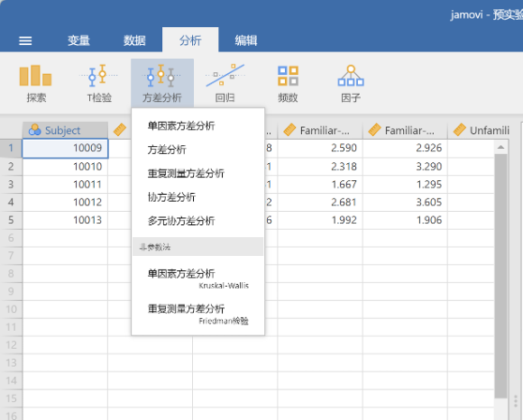
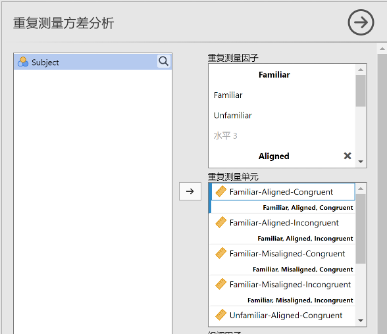
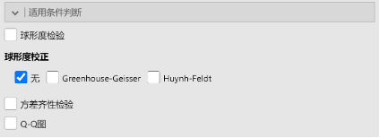
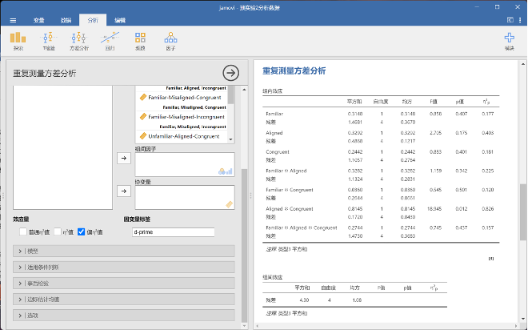
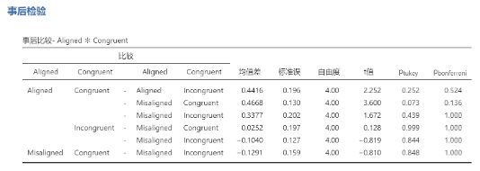
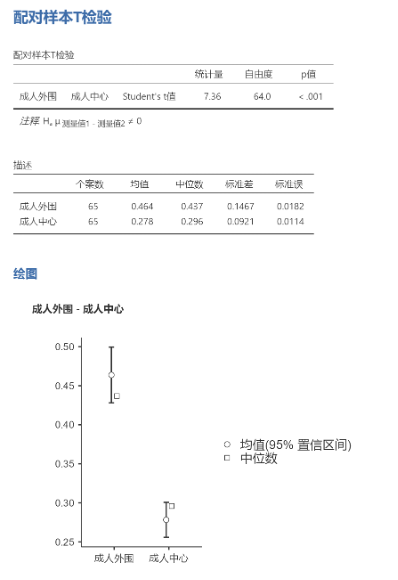
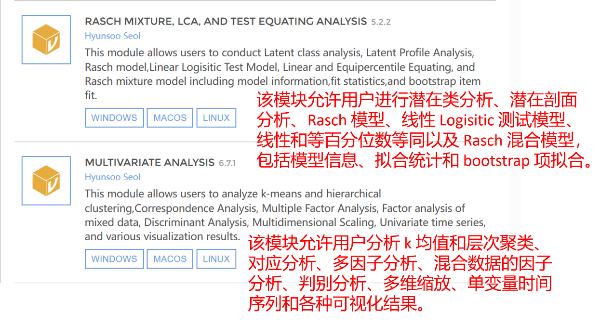

# Jamovi {#jamovi}

汇总：沈佳欣、张宇杰  
更新于：`r format(Sys.Date(), '%Y %b %d')`

## 方差分析
导入数据后，依次点击“分析”“方差分析”选项，然后在弹出的选项栏中选择适当的方差分析方法。前五个为参数检验方法，后两个为非参数检验方法，它们分别对应统计课本中的克-瓦氏单向方差分析和弗里德曼两因素等级方差分析。

  
  
此次以重复测量方差分析为例。在下图左侧的界面里，左侧是我们数据的名称，右侧的“重复测量因子”是指在研究中设置的“被试内自变量”。在本例中，我们有三个“被试内自变量”，每个自变量都有两个水平。例如我们将“重复测量因子1”定义为Familiar，它包括“familiar”和“unfamiliar”两个水平。

  
  

定义好重复测量因子后，“重复测量单元”中会出现各个自变量水平的组合，而“重复测量单元”也就是指研究中的各种实验条件。在本例中我们的实验是一个2 * 2 * 2的被试内设计，所以共有8种实验条件，我们需要做的是将数据拖入其对应的重复测量单元中。

  

接下来我们要选择效应量为“偏η²值”，以及确定因变量标签。本例中因变量标签为“d-prime”.

  

下面的五个选项里，我们应当关注的主要是“适用条件判断”和“事后检验”。

  

对本专业来说，在这一栏中较为重要的是“方差齐性检验”，如果变量中涉及被试间变量，那么应当进行方差齐性检验。但由于本例中的变量都是被试内变量，所以无需进行方差齐性检验。其他几个选项可以根据研究所需进行选取。
  
所有设定完成后，jamovi会在右侧呈现数据分析结果。

  

## 简单效应分析

这一部分承接上述重复测量方差分析。在本例中，当我们在jamovi中确定好了“重复测量因子”即“被试内变量”和“重复测量单元”即“实验条件”后，我们可以看到右侧的结果栏中就可以呈现统计结果，如果某两个或几个变量之间存在显著的交互作用，那么我们应当进行事后检验，以确定一个变量在与它有交互作用的另一个变量的哪些水平上显著，哪些水平上不显著。我们需要选择下列五个选项中的“事后检验”。

  

选择需要进行事后检验的交互变量，并按照需要选择恰当的校正方法。

  

右侧生成的结果的最右边两列就是jamovi按照我们选择的Tukey法和Bonferron法计算出的统计值。

## t检验

- 首先，导入数据
- 其次，点击选项栏的分析，选择对应的t检验

  

- 接着，选择要分析的变量

  

- 然后，可以按需勾选，描述就是分析数据的均值、标准差、标准误等描述性数据；描述图就是生成图表

  

## 额外模块推荐

  
  

可以通过jamovi官网下载自己所需要的库。这是网址：https://www.jamovi.org/library.html

  
  
  
  

